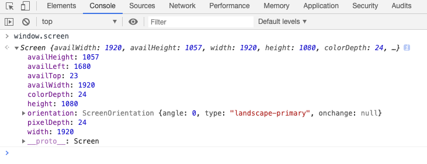

最近开发中使用了一个电商放大镜组件，遇到了这方面的问题。日常开发中，也经常会获取一个元素的尺寸与位置，借此机会，总结下来。

## 常见的尺寸与位置分类

在 web 页面开发中，尺寸和位置大致分为以下几类：
+ 屏幕的尺寸和位置
+ 元素尺寸和位置（文档，算是一个特殊的元素）
+ 鼠标的位置

### 屏幕的尺寸和位置
其中屏幕的尺寸和位置是通过`window.screen`对象来获取的，这里包含我们设备屏幕的一些信息，在我扩展屏幕的 chrome 中输入，截图如下：

其中与尺寸和位置有关的如下：
```JavaScript
screen.width // 屏幕的像素宽度
screen.height // 屏幕的像素高度
screen.availHeight // 返回浏览器窗口在屏幕上可占用的垂直空间，即最大高度
screen.availWidth // 返回浏览器窗口可占用的水平宽度（单位：像素）
screen.availLeft // 返回浏览器可用空间左边距离屏幕（系统桌面）左边界的距离
screen.availTop // 浏览器窗口在屏幕上的可占用空间上边距离屏幕上边界的像素值，在 mac 上就是任务栏的高度
```

需要说明的是可占用宽度和高度，并**不是实际占用的宽度和高度**，如果你缩小的浏览器的窗口，这两个值依然不会更改。对于`availLeft`来说，大多数情况下，该属性返回都是 0，如果你在有两个屏幕的电脑上使用该属性，在右侧屏幕计算该属性时，会返回左侧屏幕的宽度。在 windows 中，该属性取决于哪个屏幕被设为主屏幕，返回相对于主屏幕左边界的 X 坐标。
### 元素的尺寸和位置

元素的尺寸与盒子模型和 CSS有关。


```JavaScript
element.clientWidth 
element.clientHeight
```
// 以上两个属性都是只读属性，对于没有定义 CSS 或者 内联布局盒子的元素为 0，否则，他是元素内部的宽高，
// 包含 padding，但不包括滚动条、边框和外边框。

element.offsetWidth
element.offsetHeight
// 以上两个属性都是只读属性，它返回该元素的像素宽高，包含该元素的垂直内边距和边框，且是一个整数。
// 通常，元素的offsetHeight是一种元素 CSS 宽高的衡量标准，包括元素的 border、
// padding 和元素的水平滚动条（如果存在且渲染的话），不包含:before或:after等伪类元素的高度
```JavaScript
element.offsetWidth
element.offsetHeight
// 以上两个只读属性是元素内容宽度的一种度量，包括由于 overflow 溢出而在屏幕上不可见的内容
```
DOM 元素的尺寸与位置相关属性都是相对位置，如下：
```JavaScript

// 元素的尺寸
element.offsetParent // 获取偏移容器
element.
```

## 参考内容

- [web前端开发中常用的尺寸和位置](https://www.cnblogs.com/pelli/p/6100420.html)
- [用Javascript获取页面元素的位置](http://www.ruanyifeng.com/blog/2009/09/find_element_s_position_using_javascript.html)
